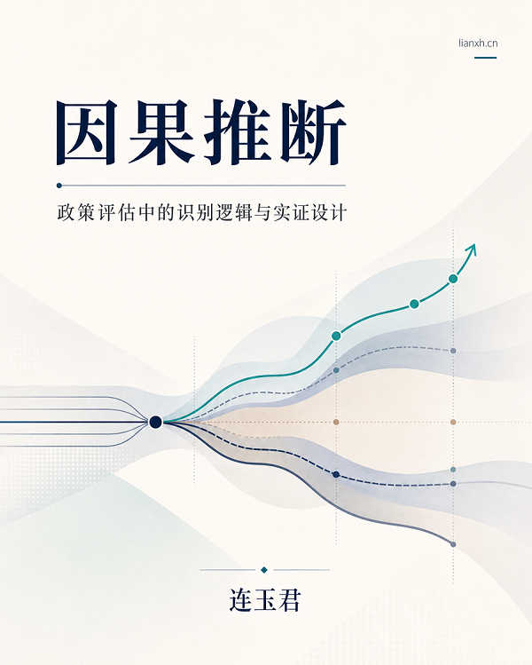

# 🏠 前言 {.unnumbered}



 

## 简介

*生成日期：*

本讲义的主题是「因果推断：政策评估中的识别思维与实证设计」。它不把因果推断写成模型名称的清单，而是从政策评估中最常见的工作流程出发：先理解政策目标和实施机制，再判断政策如何进入数据，随后识别样本选择、遗漏变量、反事实构造和设定偏误等问题。

全书围绕一条主线展开：

```text
政策目标 → 政策实施机制 → 数据形成机制 → 识别威胁 → 研究设计 → 估计方法 → 结果解释
```

在这条主线下，DID、DDD、事件研究、合成控制、Heckman 思维、固定效应、FWL、DDML 和 AI-Agent 工作流，都被放回政策评估的具体场景中讨论。

本讲义的目标是：

-   从政策目标出发，理解结果变量、处理组、对照组和政策时点为什么不能事后随意选择。
-   理解数据形成机制、样本选择、自选择和遗漏变量如何影响政策评估结论。
-   掌握 DID、DDD、事件研究、合成控制、固定效应、FWL 和 DDML 在研究设计中的位置。
-   学会阅读经典论文、拆解复现材料，并把国内政策场景转化为可检查的研究设计。
-   了解 AI 和 Agent 工具如何辅助论文阅读、代码审计和复现工作，同时保留必要的人工判断。

## 各章内容安排

-   第 1 章讨论如何从政策背景走向研究设计，重点是政策目标、处理对象和结果变量之间的关系。
-   第 2 章讨论政策如何进入数据，重点是处理组、对照组、政策时点、数据层级和合并键。
-   第 3 章讨论样本选择、自选择与 Heckman 思维，重点是哪些对象被我们观察到，哪些对象被排除在样本之外。
-   第 4 章讨论遗漏变量、控制变量、固定效应和交互固定效应，重点是如何把不可观测差异纳入研究设计。
-   第 5 章讨论反事实构造，重点是 DID、DDD、事件研究和合成控制在政策评估中的使用边界。
-   第 6 章讨论 DID 设计中的识别选择，重点是分批处理、处理效应异质性和现代 DID 估计量。
-   第 7 章讨论 FWL、DDML 与设定偏误，重点是如何用 partial out 思维处理高维控制变量和非线性函数形式。
-   第 8 章讨论 AI 和 Agent 如何辅助论文阅读、复现包审计和研究工作流管理。
-   第 9 章整理课后阅读资料，为读者继续学习教材、在线书籍、方法论文和复现资源提供入口。

除正文外，本讲义还包含若干附录和 Notebook。附录用于补充政府引导基金、Heckman 选择模型等专题材料；Notebook 用于展示部分方法的可运行示例和复现入口。读者可以先按正文顺序阅读，遇到需要动手验证的部分，再进入对应 Notebook。

## 如何使用本讲义？

本讲义使用 VS Code + Quarto 编写，并通过 GitHub Pages 发布。详情可参见 [Quarto books](https://lianxhcn.github.io/quarto_book/)。

-   可以 [Fork](https://github.com/lianxhcn/ci-policy/fork) 本讲义的 [GitHub 仓库](https://github.com/lianxhcn/ci-policy)，在本地阅读、修改和运行部分示例。
-   如果希望在 Jupyter Notebook 中运行 Stata 和 Python 代码，需要先配置相应环境。可参考 [数据分析与经济决策](https://lianxhcn.github.io/ds2026/) 第 2-4 章。
-   如果希望寻找更多中国政策冲击案例，可访问 [China Policy Shocks](https://lianxhcn.github.io/china-policy-shocks/) 及其 [政策汇编页](https://lianxhcn.github.io/china-policy-shocks/appendix_policy_list.html)。阅读时可重点关注政策对象、冲击时间、数据合并键和识别设计是否清楚。
-   讲义中难免错漏之处，还请不吝指出：[arlionn\@163.com](mailto:arlionn@163.com){.email}。也可以在本书 GitHub 仓库提交 [issues](https://github.com/lianxhcn/ci-policy/issues)。

---

[主页](https://www.lianxh.cn) \| [课程](https://www.lianxh.cn/details/17.html) \| [书稿](https://www.lianxh.cn/Books.html) \| [推文](https://www.lianxh.cn/blogs/all.html) \| [资料](https://www.lianxh.cn/share.html)
